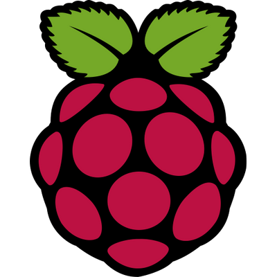

<!-- PROJECT LOGO -->
<br />
<p align="center">
  <a href="https://github.com/github_username/repo_name">
    
    
  </a>

  <h3 align="center">RPi K3S Cluster</h3>

  <p align="center">
    A guide to help you setup a K3S cluster using Raspberry Pi
    <br />
  </p>
</p>

<!-- TABLE OF CONTENTS -->
<details open="open">
  <summary><h2 style="display: inline-block">Table of Contents</h2></summary>
  <ul>
    <li>
      <a href="#prerequisites" style="color: black; font-weight:bold; text-decoration:none;">Prerequisites</a>
    </li>
    <li>
      <b>Setting up the Cluster</b>
    </li>
    <ul>
    <li><a href="#setting-up-the-microsd-card">Setting up the microSD card</a></li>
    <li><a href="#configure-ssh-and-wifi">Configure SSH and WiFi</a></li>
    <li><a href="#setting-up-raspberry-pi">Setting up Raspberry Pi</a></li>
    <li><a href="#installing-k3s-server">Installing K3S Server</a></li>
    <li><a href="#installing-k3s-agent">Installing K3S Agent</a></li>
    <li><a href="#access-kubernetes-cluster-from-your-machine">Access Kubernetes Cluster from your machine</a></li>
  </ul>
  <li><b>Extras</b></li>
    <ul>
    <li><a href="#installing-kubernetes-dashboard">Installing Kubernetes Dashboard</a></li>
    <li><a href="#access-kubernetes-cluster-from-your-machine">Access Kubernetes Cluster from your machine</a></li>
    <li><a href="#exposing-the-dashboard">Exposing the dashboard</a></li>
    <li><a href="#installing-nginx-ingress">Installing NGINX Ingress</a></li>
    <li><a href="#building-docker-image-for-rpi">Building Docker Image for RPi</a></li>
  </ul>
  </ul>
</details>

## Prerequisites

### Hardware Components

-   Raspberry Pi x 2
-   16 GB microSD Card x 2

### Software Components

-   [Raspberry Pi Imager](https://www.raspberrypi.org/software/)

## Setting up the microSD card

**After installing Raspberry Pi Imager on your system**, launch it and install **Ubuntu Server 20.04.2** on your microSD card.


## Configure SSH and WiFi

After installing Ubuntu on the SD card, open the file `network-config` in SD Card directory with a Text Editor.

Remove the hashtag in front of the following lines to set up the WiFi

```
wifis:
  wlan0:
  dhcp4: true
  optional: true
  access-points:
    "yourSSID":
      password: "yourPassword"
```

To set up SSH, create a new empty file named ssh, without any extension, inside the boot directory.

## Setting up Raspberry Pi

To set up your RPi before installing K3S, type the following command to SSH into your RPi:

```sh
sudo nano /boot/firmware/cmdline.txt
```

Add the following options:

```
cgroup_enable=memory cgroup_memory=1
```

Reboot the RPi using the command `sudo reboot`

## Installing K3S Server

Run the command below, in the master node's terminal, to install K3S Server:

```sh
curl -sfL https://get.k3s.io | INSTALL_K3S_EXEC="server --no-deploy traefik" sh
```

_Once the installation is completed, check the status of K3S using_ `sudo systemctl status k3s`

**After successfully installing the K3S Server**, run the following commands to get the join token for the worker nodes, in the terminal of the master node:

```sh
cat /var/lib/rancher/k3s/server/node-token
```

## Installing K3S Agent

In the terminal of worker nodes, run the the following command to install the K3S agent

```sh
export MASTER_IP="Your Master Node IP Address"
export K3S_TOKEN="Your Token Here"
sudo k3s agent --server ${MASTER_IP} --token ${K3S_TOKEN}
```

## Access Kubernetes Cluster from your machine

Run the command below in the terminal of the **Master**

```sh
sudo cat /etc/rancher/k3s/k3s.yaml
```

Copy the command output and paste it in kubectl config on your machine, which is at `~/.kube/config`

_If there is no config file inside `~/.kube`, create a file named **config** with no extensions_

## Installing Kubernetes Dashboard

Run the following commands to install the dashboard:

```sh
GITHUB_URL=https://github.com/kubernetes/dashboard/releases
VERSION_KUBE_DASHBOARD=$(curl -w '%{url_effective}' -I -L -s -S ${GITHUB_URL}/latest -o /dev/null | sed -e 's|.*/||')
sudo k3s kubectl create -f https://raw.githubusercontent.com/kubernetes/dashboard/${VERSION_KUBE_DASHBOARD}/aio/deploy/recommended.yaml
```

Then, create the following files:

**dashboard.admin-user.yml**

    ```yml
    apiVersion: v1
    kind: ServiceAccount
    metadata:
        name: admin-user
        namespace: kubernetes-dashboard
    ```

**dashboard.admin-user-role.yml**

    ```yml
    apiVersion: rbac.authorization.k8s.io/v1
    kind: ClusterRoleBinding
    metadata:
        name: admin-user
    roleRef:
        apiGroup: rbac.authorization.k8s.io
        kind: ClusterRole
        name: cluster-admin
    subjects:
        - kind: ServiceAccount
        name: admin-user
        namespace: kubernetes-dashboard
    ```

Then, run the command below to create a dashboard user

```sh
sudo k3s kubectl create -f dashboard.admin-user.yml -f dashboard.admin-user-role.yml
```

Then, get the dashboard token by running

```sh
sudo k3s kubectl -n kubernetes-dashboard describe secret admin-user-token | grep '^token'
```

### Exposing the dashboard

To expose the dashboard, changes the service type of the dashboard from `ClusterIP` to `NodePort`

First, run the following command:

```sh
kubectl -n kubernetes-dashboard edit service kubernetes-dashboard
```

Then, change `spec.type` to `NodePort`

```
spec:
  clusterIP: 10.43.31.58
  clusterIPs:
  - 10.43.31.58
  externalTrafficPolicy: Cluster
  ports:
  - nodePort: 32208
    port: 443
    protocol: TCP
    targetPort: 8443
  selector:
    k8s-app: kubernetes-dashboard
  sessionAffinity: None
  type: NodePort
```

Next, generate a self-signed certificates for the dashboard

```sh
openssl req -newkey rsa:4096 -x509 -sha256 -nodes -out ~/certs/dashboard.crt -keyout ~/certs/dashboard.key
```

Then, create a `Secret` object by running:

```sh
kubectl delete secret kubernetes-dashboard-certs -n kubernetes-dashboard
kubectl create secret generic kubernetes-dashboard-certs --from-file=$HOME/certs -n kubernetes-dashboard
```

Finally, edit the config Kubernetes Dashboard Deployment by running

```sh
kubectl -n kubernetes-dashboard edit deployment kubernetes-dashboard
```

Your `containers.args` should look like this:

```
      containers:
      - args:
        - --auto-generate-certificates
        - --namespace=kubernetes-dashboard
        - --tls-cert-file=/dashboard.crt
        - --tls-key-file=/dashboard.key
```

The dashboard can now be access at https://master-ip:32208

## Installing NGINX Ingress

Run the command below to install NGINX Ingress

```sh
kubectl apply -f https://raw.githubusercontent.com/kubernetes/ingress-nginx/controller-0.32.0/deploy/static/provider/cloud/deploy.yaml
```

## Building Docker Image for RPi

On your machine, create a buildx builder

```sh
docker buildx create --name rpi --use
```

Then, build the image and push by running

```sh
docker buildx build --platform linux/amd64,linux/arm64,linux/arm/v7 -t pholawat-tle/image-name --push .
```
